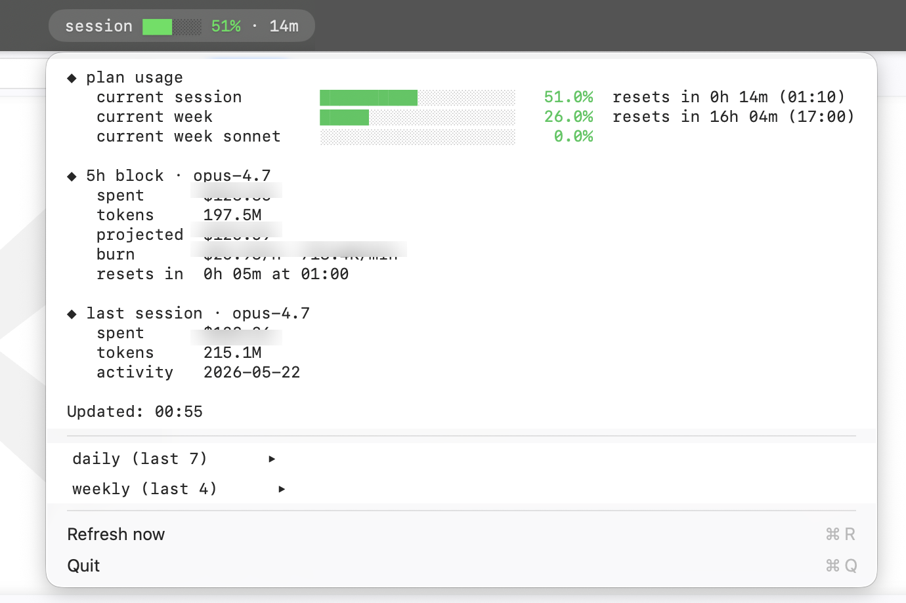

# claude-usage-bar

> Native macOS menu bar widget that surfaces Claude Code's `/usage` view at a glance — coloured progress bars for your subscription's 5-hour and 7-day rate-limit windows, plus per-session cost overlay from [`ccusage`](https://www.npmjs.com/package/ccusage).

<!-- Drop a screenshot at docs/screenshot.png — Cmd+Shift+4 around the dropdown works well. -->


The menu bar title reads `session 37% · 87m` — **37%** of your current 5-hour rate-limit window is consumed and the window resets in **87 minutes**. The same numbers Claude Code shows when you type `/usage` in an interactive session, except always visible.

## Why

`/usage` only works inside an interactive Claude Code session (`claude -p "/usage"` returns a stub). This widget calls the same backend endpoint Claude Code uses (`/api/oauth/usage`) with the OAuth token Claude Code already keeps in your macOS keychain, then layers `ccusage`'s cost estimates on top of the raw utilization percentages.

## What's in the dropdown

- **plan usage** — colored progress bars for `current session` (5h), `current week` (7d), `current week opus`, `current week sonnet`. Green <60%, yellow 60–85%, red >85%. Colors adapt to dark/light mode.
- **5h block** — cost, tokens, projected total, burn rate, reset time (from ccusage).
- **last session** — most recent session id, cost, tokens, last activity.
- **daily ▸** / **weekly ▸** — submenus with the last 7 days / 4 weeks of cost & token totals.
- Refresh now (⌘R), Quit (⌘Q).

## Install

```bash
git clone https://github.com/meduzkin/claude-usage-bar.git
cd claude-usage-bar
./install.sh
```

That:

1. Checks prerequisites (`python3`, `npx`/`ccusage`, and `swiftc` only if a rebuild is needed) and exits with a clear error if anything is missing.
2. Triggers the macOS keychain prompt so you can click **Always Allow** during install rather than at first widget launch.
3. Uses the committed pre-built universal binary (arm64 + x86_64) unless `main.swift` is newer or you pass `--build`. So most installs skip the Swift toolchain entirely.
4. Optionally registers a LaunchAgent at `~/Library/LaunchAgents/com.local.claude-usage-bar.plist` so the widget starts at login.

Flags:

- `./install.sh --autostart` — non-interactive, installs the LaunchAgent without prompting.
- `./install.sh --build` — force a fresh build even if the pre-built binary is up to date.

To remove: `./uninstall.sh` (stops the widget and removes the LaunchAgent; the binary and keychain ACL stay).

## Requirements

- macOS (uses Cocoa / `NSStatusItem`)
- An active Claude Code login on this Mac — that's what creates the `Claude Code-credentials` keychain entry the widget reads
- `python3` on `PATH` (parses keychain JSON and merges ccusage output)
- `node` / `npx` on `PATH` (for [`ccusage`](https://www.npmjs.com/package/ccusage); a globally installed `ccusage` is preferred and faster)
- Swift toolchain (`xcode-select --install`) — **only** if you intend to rebuild from source; the repo ships a pre-built universal binary

## How auth works

The widget reads the access token directly from the macOS keychain entry `Claude Code-credentials` via:

```bash
security find-generic-password -s "Claude Code-credentials" -w
```

Claude Code itself creates and refreshes that entry — the widget only reads. The first time `security` runs, macOS pops the standard "an application wants to access keychain" dialog. Click **Always Allow** and subsequent reads from `usage.sh` (which calls the same `/usr/bin/security` binary) are silent.

For headless / CI setups, set `CLAUDE_CREDS=/path/to/file` and `usage.sh` reads the same `{"claudeAiOauth": {...}}` JSON from that file instead.

## How it works

- **`usage.sh`** — resolves the OAuth token, calls `https://api.anthropic.com/api/oauth/usage` with the `anthropic-beta: oauth-2025-04-20` header for plan utilization, runs `ccusage` (`blocks --active`, `daily`, `weekly`, `session`) for cost data, and merges everything into one JSON blob via inline `python3`.
- Successful API responses are cached at `~/.cache/claude-usage-bar/oauth.json`. The endpoint rate-limits aggressively (429s within a few requests per minute), so on failure the widget falls back to the cached response — the bars stay visible even when the endpoint refuses to talk to us.
- On a `401` `usage.sh` re-reads from keychain and retries once, in case Claude Code rotated the token.
- **`main.swift`** — Cocoa app with `NSStatusItem`, refreshes every 15 minutes in the background **plus** every time you open the dropdown (with a 30-second cooldown to avoid spamming the rate-limited endpoint). All menu items wrap their content in custom `NSView`s with opaque backgrounds so the dropdown reads more solidly than the default vibrancy material.
- **`build.sh`** — produces a universal binary (`swiftc` + `lipo` over arm64 and x86_64 slices).

## Known limits

- The `/api/oauth/usage` endpoint is throttled — background refresh is locked at 15 min and on-open at 30s cooldown to stay clear of the rate limit. If you hit a 429 anyway, the widget shows cached values until the next successful call.
- `ccusage` cost figures are estimates from local JSONL session files and won't exactly match Anthropic's internal billing.
- No notarization / code signing — macOS Gatekeeper may warn on first launch if the binary was downloaded as a zip (cloning via git is fine, no quarantine attribute is set).

## Disclaimer

This is an unofficial community tool, not affiliated with or endorsed by Anthropic. "Claude" and "Claude Code" are trademarks of Anthropic. It reads the OAuth token Claude Code already stored on your machine and calls a public Anthropic API endpoint; it does not bypass any auth, send any data anywhere else, or modify your Claude Code installation.

## License

Apache 2.0 — see [LICENSE](LICENSE).
